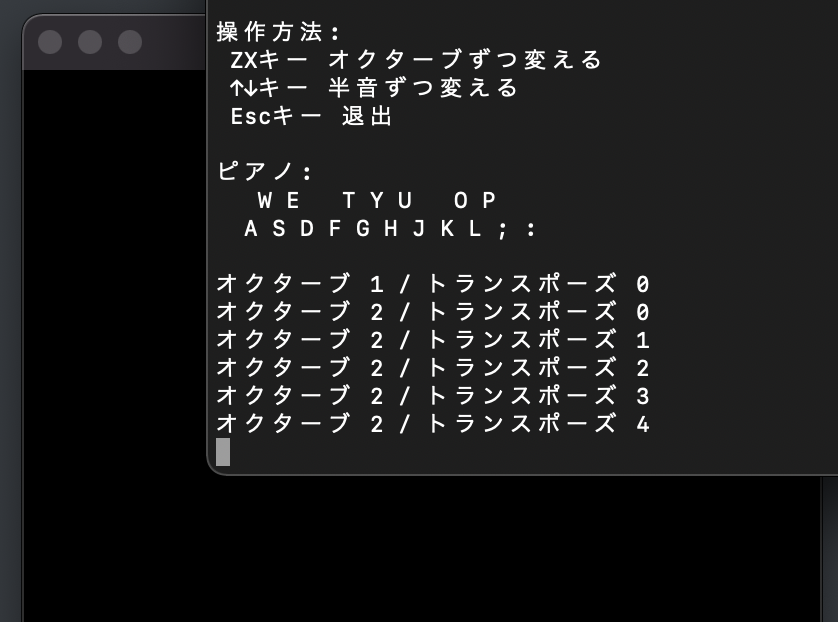

# tp-piano

Garageband のミュージックタイピング (キーボードから鳴らせる鍵盤) にトランスポーズ機能を付けたものです。

Python で動きます。

### 必要なもの

* Python (3.9.9で動作することを確認)
* pygame のパッケージ
* **Garageband**

### 使用方法

1. Garageband を開いて、好きな楽器を選ぶ。
2. tp-piano の *main.py* を実行する。
3. 出てきた小ウィンドウをアクティブにして、好きなキーを押すと音が鳴る。

### 参考にしたもの

* Python で Garageband 経由で音を鳴らす方法: https://kagari.github.io/note/2020/macos_pygame_midi/

* キーの押下を判定する方法: https://shizenkarasuzon.hatenablog.com/entry/2019/02/08/184932

…その他色々。

## まとめ

トランスポーズ機能のある MIDI キーボードを買った方が早いです。